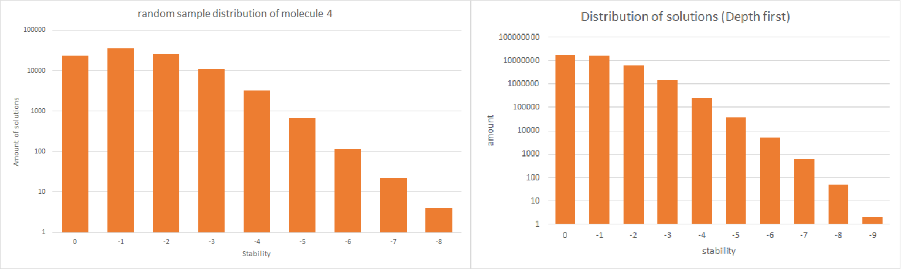

# Resultaten

## structuur:

De results zijn opgedeeld per algoritme waarin mappen zijn gegeven voor de verschillende moleculen.

## toelichting:

### Depth first:
Met depth first zijn de eerste twee moleculen hun beste configuratie gevonden. deze resulaten zijn te zien in hun mappen.

#### Depth first vs Randomsample:
In molecule 2 kunnen we Depth first vergelijken met random sample.

We kunnen uit deze figuren opmaken dat onze random sample distributie gemiddelde (-1.37215) hoger is dan het gemiddelde van de totale solution space (-0.811233166). Dit komt door de manier waarop de random solutions gegenereerd worden, namelijk per aminozuur.

#### Depth first vs annealing:
Omdat we met een depth first algoritme de totale statespace van molecuul 2 hebben verkent kunnen we aan molecule 2 nog zien hoe goed onze annealing algoritme het doet. Volgens depth first is de beste stability -9. Deze hebben we ook gevonden met annealing.

Beste annealing oplossing:

### Randomsample vs annealing:
Bij de grotere moleculen is er geen depth first oplossing beschikbaar dus moeten we de annealing oplossing vergelijken met de random sample distributie.

##### Molecule 3:
De beste annealing oplossing die we hebben gevonden is van stabiliteit van -12 (zie plaatje) dit is drie stability punten lager dan gevonden in de willkeurige oplossingen distributie (n = 100.000). Dit vertelt ons dat we een stabiliteit hebben gevonden die een erg lage oplossingsdichtheid heeft.

#### Molecule 4:
In molecule 4 hebben we uitgebreider het verschil getest tussen beide algoritmes. het verschil in de distributies is hieronder te zien:

De beste oplossing gevonden is -20 deze is 7 stabiliteit punten beter dan de randomsample geeft

