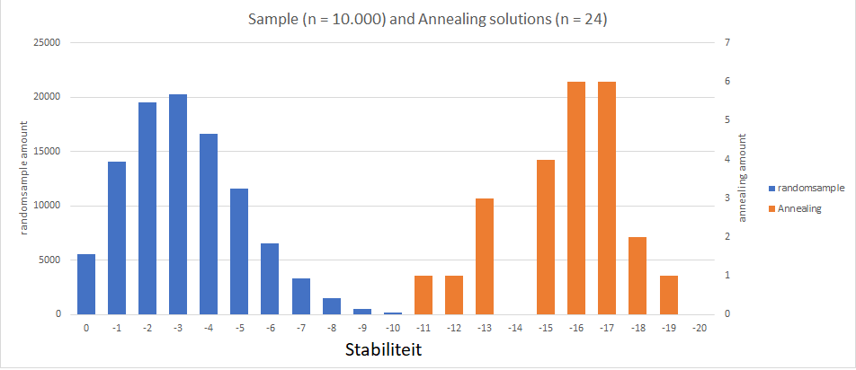

# Resultaten

## Mappenstructuur

De resultaten zijn opgedeeld per algoritme waarin mappen zijn gegeven voor de verschillende moleculen. Toelichting op de resultaten is hieronder te vinden, net als een analyse van de pijpunten van het probleem.

## Resultaten: Toelichting

### Depth First
Met depth first zijn de eerste twee moleculen hun beste configuratie gevonden. deze resulaten zijn te zien in hun mappen.

#### Depth First vs Random Sample
In molecule 2 kunnen we Depth first vergelijken met random sample.

We kunnen uit deze figuren opmaken dat onze random sample distributie gemiddelde (-1.37215) hoger is dan het gemiddelde van de totale solution space (-0.811233166). Dit komt door de manier waarop de random solutions gegenereerd worden, namelijk per aminozuur.

#### Depth First vs Simulated Annealing
Omdat we met een depth first algoritme de totale statespace van molecuul 2 hebben verkent kunnen we aan molecule 2 nog zien hoe goed onze annealing algoritme het doet. Volgens depth first is de beste stability -9. Deze hebben we ook gevonden met annealing.

Beste annealing oplossing:

### Random Sample vs Simulated Annealing
Bij de grotere moleculen is er geen depth first oplossing beschikbaar dus moeten we de annealing oplossing vergelijken met de random sample distributie.

##### Molecule 3
De beste annealing oplossing die we hebben gevonden is van stabiliteit van -12 (zie plaatje) dit is drie stability punten lager dan gevonden in de willkeurige oplossingen distributie (n = 100.000). Dit vertelt ons dat we een stabiliteit hebben gevonden die een erg lage oplossingsdichtheid heeft.

#### Molecule 4
In molecule 4 hebben we uitgebreider het verschil getest tussen beide algoritmes. het verschil in de distributies is hieronder te zien:

De beste oplossing gevonden is -20 deze is 7 stabiliteit punten beter dan de randomsample geeft.

## Analyse Pijnpunten van het Probleem
Bij het vergaren van resultaten zijn verscheidene zaken opgevallen, die ons doen inzien waar de pijnpunten liggen bij het oplossen van dit probleem. Hieronder worden die opvallende zaken per algoritme besproken.

### Depth First
Het gebruikte depth first algoritme is heerlijk, in het opzicht dat het gegarandeerd een beste oplossing oplevert. Dit is natuurlijk een prachtige zekerheid om te hebben, maar die wordt ook duur verkocht: het algoritme kost bakken met tijd. Voor de eiwitten van 36 aminozuren en langerheeft het algoritme dan ook geen oplossingen opgeleverd, omdat het daar simpelweg te lang voor zou moeten draaien.

Dit wordt geïllustreerd in de volgende tabel, waarin bij de verschillende eiwitlengtes uit de probleestelling de grootte van de toestandsruimte en de daarbij behorende draaitijd van het depth first algoritme zijn berekend. Hoe deze toestandsruimtegroottes zijn berekend is te lezen in de [hoofdmap van deze GitHub.](https://github.com/koenkoen1/OriBunshi "Project Hoofdmap"]

| Eiwitlengte | Toestandsruimte | Tijd   |
|-------------|-----------------|--------|
| 8           | 486             | <1 min |
| 14 | 3,5 * 105 | 1 min |
| 20 | 2,6 * 108 | 743 min (~12u) |
| 36 | 1,1 * 1016 | ~60000 jaar |
| 50 | 5,3 * 1022 | Te lang |

Met de resultaten van het depth first algoritme, zijn de oplossingsdichtheden van de opgeloste eiwitten uitgerekend. Deze blijken ontzettend laag te zijn, zoals al te zien was in de rechtergrafiek van het figuur dat hierboven bij __Depth First vs Random Sample__ staat. In de tabel hieronder zijn de gevonden beste oplossing en de berekende oplossingsdichtheid van deze beste oplossing voor de met depth first opgeloste eiwitten getoond.

| Eiwitlengte   | Beste stabiliteit | Beste-oplossingsdichtheid  |
|----|----|------------|
| 8  | -3 | 2.2%       |
| 14 | -6 | 0.0254%    |
| 21 | -9 | 0.0000048% |

De kans om een beste oplossing tegen te komen is daarmee erg klein. Met een random sampler zullen we dus bijvoorbeeld waarschijnlijk niet een beste oplossing tegenkomen. (Dat wordt ook bevestigd door de resultaten. Zie de toelichting hierboven.)

### Steepest Ascent Hill Climber
Bij het geteste greedyclimb algoritme, viel het op dat vershillende moleculen zeer snel in een locaal minimum vast komen te zitten. Dit is te wijten aan het inwendige spiegelvlak van de symmetrische aminozuurketens, dat ervoor zorgt dat zulke eiwitten na twee vouwen al in een aardige configuratie terechtkomen, zoals te zien in de afbeelding hieronder. Vooruitkijken zou dit algoritme waarschijnlijk ook niet helpen, aangezien de eiwitten een aardig groot aantal vouwingen zouden moeten ondergaan om uit dit eerste locale minimum te ontsnappen.

### Stochastic Hill Climber
Net als het steepest ascent hill climber algoritme, heeft het stochastische hill climber algoritme last van locale minima. We hebben geprobeert om de steepest ascent hillclimber te verbeteren door in plaats van naar alle mogelijke zetten vanaf een situatie een random aantal turns te doen. dit werkt al beter dan de steepest ascent hill climber maar dit lost het probleem van de locale minima niet op.

### Simulated Annealing
De stochastic Hill Climber is uitgebreid om uit de locale minima te kunnen ontsnappen. We hebben de hillclimber een kans gegeven om terug te vallen naar een slechtere configuratie om vanuit daar weer te te kijken of er een mogelijkheid is om naar een andere oplossing toe te werken. Dit is een simulated annealing algoritme. Om nog betere resulaten te krijgen is ook een reheating schema toegevoegd. Dit alles om locale minima te vermeiden.

### Population Based

In de afbeelding hierboven is van een run met 100 populaties van het population based algoritme de gemiddelde stabiliteit van alle generaties uitgezet tegen de iteraties. Zoals heel duidelijk te zien is, wordt zeer snel een gemiddelde stabiliteit van -16 bereikt, die de ghele daaropvolgende draaitijd niet meer verbeterd wordt. Dit komt waarschijnlijk doordat, met de gebruikte elitaire (top 50% resultaten) selectiemethode, het algoritme zeer snel enkel nog kinderen van één en dezelfde generatie genereert en dus in wezen vastzit in een locaal minimum. De implementatie van een andere selectiemethode zou hier een oplossing voor kunnen vormen.
